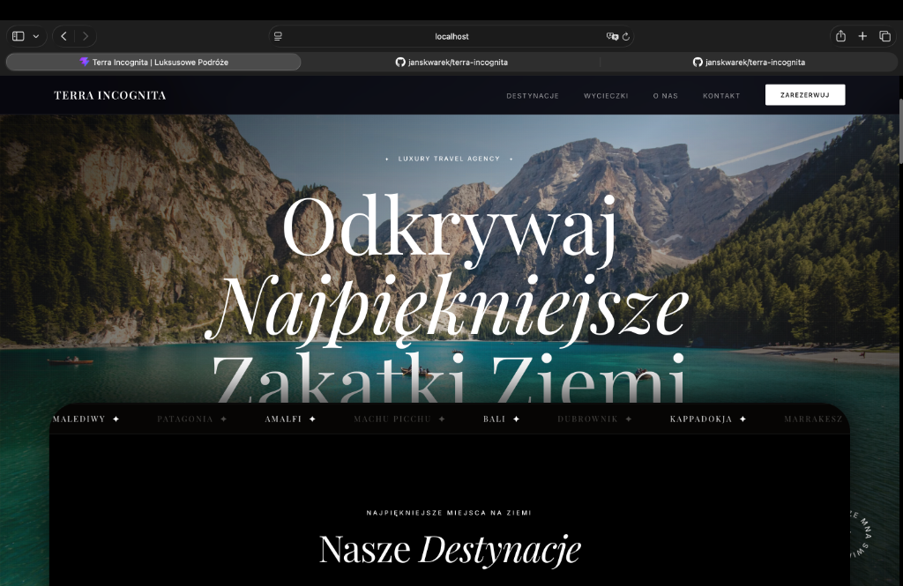
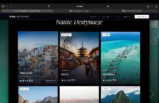
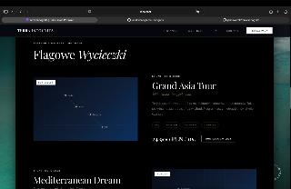
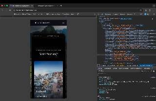

# Terra Incognita — Luxury Travel Agency

[](https://vitejs.dev/)
[](https://reactjs.org/)
[](https://github.com/darkroomengineering/lenis)

**Terra Incognita** to nowoczesny, luksusowy portal turystyczny zaprojektowany z myślą o najbardziej wymagających podróżnikach. Aplikacja łączy w sobie minimalistyczny design (Black & White Aesthetic) z zaawansowanymi technikami animacji, tworząc unikalne doświadczenie wizualne (Digital Experience).

---

## 📸 Główne Widoki (Screenshots)

### 1. Widok startowy (Hero Slideshow)

*Pierwsze wrażenie po wejściu na stronę – pełnoekranowy, kinowy pokaz slajdów z wysokiej rozdzielczości zdjęciami z Unsplash.*

### 2. Efekt Kurtyny (Curtain Reveal)

*Sztandarowy efekt wizualny aplikacji – panel z treścią płynnie najeżdżający na animowane tło, tworząc głębię 3D.*

### 3. Katalog Destynacji

*Przejrzysty układ kart z interaktywnymi hoverami, zaokrąglonymi rogami i kompletem danych o wycieczkach.*

### 4. Flagowe Wycieczki

*Prezentacja konkretnych programów wypraw z interaktywnymi mapami punktowymi i szczegółami trasy.*

### 5. Responsywność Mobilna

*Pełna optymalizacja dla urządzeń mobilnych – responsywny hamburger menu oraz płynna typografia.*

---

## ✨ Kluczowe Funkcje

- **Infinite Scroll Design**: Mechanizm płynnej pętli, który po dotarciu do stopki niezauważalnie przenosi użytkownika z powrotem na start.
- **Cinematic Experience**: Wykorzystanie wysokiej rozdzielczości zdjęć z Unsplash API z efektami przejść typu Fade & Zoom.
- **Smooth Scrolling**: Integracja z biblioteką **Lenis** dla zapewnienia gładkiego ruchu na wszystkich urządzeniach.
- **Glassmorphic Navigation**: Wielopoziomowe menu z efektem rozmycia (backdrop-filter) i inteligentną zmianą kontrastu podczas przewijania.
- **Curtain Reveal Effect**: Nowoczesna technika layoutu, gdzie główna treść aplikacji "wsuwa się" na tło jako osobna warstwa.

---

## 🛠 Stos Technologiczny

- **Frontend**: React (Vite)
- **Stylizacja**: CSS Modules + Global CSS Variables
- **Animacje**: CSS Keyframes + Intersection Observer API
- **Smooth Scroll**: Lenis JS
- **Zasoby**: Unsplash API (Dynamiczne obrazy)

---

## 🚀 Instalacja i Uruchomienie

Aby uruchomić projekt lokalnie, wykonaj poniższe kroki:

1. **Sklonuj repozytorium**:
   ```bash
   git clone https://github.com/janskwarek/terra-incognita.git
   ```

2. **Zainstaluj zależności**:
   ```bash
   npm install
   ```

3. **Uruchom serwer deweloperski**:
   ```bash
   npm run dev
   ```

4. **Zbuduj wersję produkcyjną**:
   ```bash
   npm run build
   ```

---

## 📄 Licencja

Projekt stworzony na własne potrzeby edukacyjne i prezentacyjne. Wszystkie zdjęcia pochodzą z serwisu Unsplash na licencji darmowej.

---
Created with ❤️ by [janskwarek](https://github.com/janskwarek)
